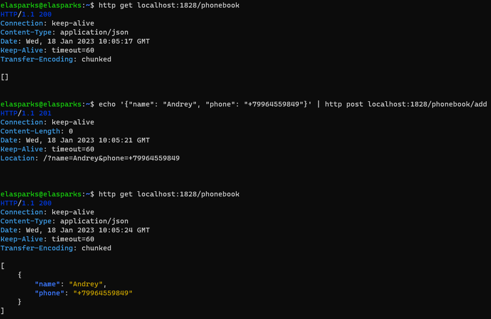

# PhoneBook
> Backend part of phonebook app.
## Introduction
It was required to implement a primitive graphical application "phone book". To implement this task, a simple REST API application was written, with which the frontend part will interact in the future.
## Dependencies

<ul>
<li>OpenJDK-8</li>
<li>Gradle</li>
</ul>

## Usage
Clone repository:

```sh
git clone https://github.com/thekravchan/PhoneBook
```

Run the programm:

### MacOS/Linux:

```sh
./gradlew bootRun
```

### Windows:

```sh
gradlew bootRun
```

## Preview


## Api requests

### GET
All records:
```sh
/phonebook
```

Search:
```sh
/phonebook?name=&phone=
```

Download:
```sh
/phonebook/download
```

### POST
Add record:
```sh
/phonebook/add +json{name:"",phone:""}
```
### PUT
Edit record:
```sh
/phonebook?name=&phone= +json{name:"",phone:""}
```
### DELETE
Delete all:
```sh
/phonebook
```

Delete a specific:
```sh
/phonebook?name=&phone=
```
